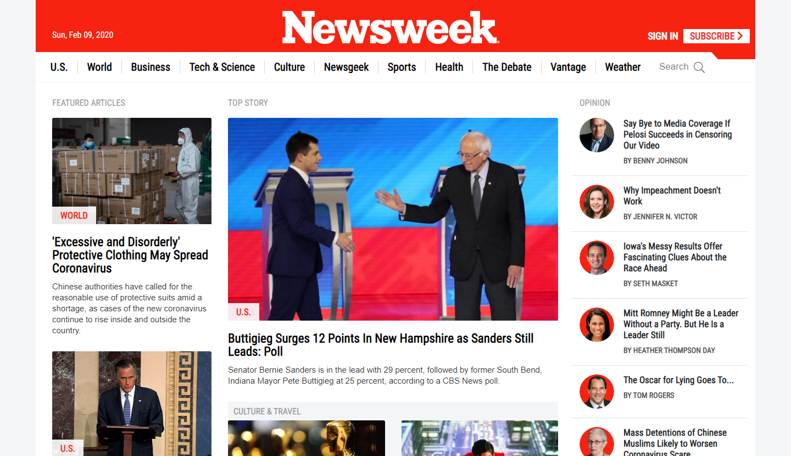
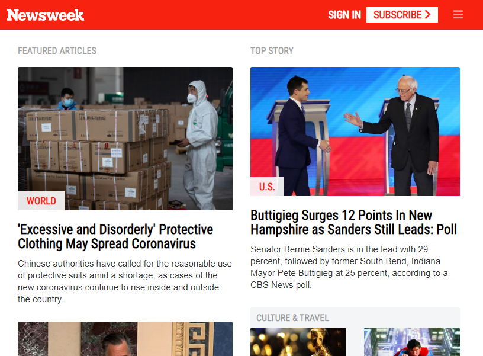
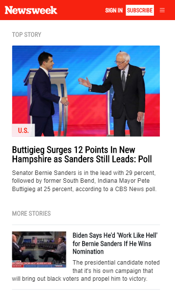

# newsweek-clone

This project is a clone of Newsweek homepage. Responsiveness achieved using Bootstrap framework.
>Screen shot in desktop screens

>Screen shot in tablet devices

>Screen shot in mobile devices

>Project built using basic HTML, CSS and Bootstrap.

This static page contains:

- Navbar
- Article sections built with Bootstrap rows and columns
- Footer

# What it does

It shows you a static clone of [Newsweek](https://www.newsweek.com/).

## Built With

- HTML 5
- CSS 3

#### and deployed to Raw Githack

## Live Demo

[Live Demo](https://rawcdn.githack.com/tirthajyoti-ghosh/newsweek-clone/f8fba05ede8fe48b6ad071f23cd66d38ad9388fb/index.html)

## 🤝 Contributing

Contributions, issues and feature requests are welcome! Start by:

- Forking the project
- Cloning the project to your local machine
- `cd` into the project directory
- Run `git checkout -b your-branch-name`
- Make your contributions
- Push your branch up to your forked repository
- Open a Pull Request with a detailed description to the development branch of the original project for a review

## Attributions and Credit

Special thanks to [Microverse](https://www.microverse.org/)
Developers of [Bootstrap](https://getbootstrap.com/)
[Newsweek](https://www.newsweek.com/)

## Authors

👤 **Tirthajyoti Ghosh**

- Github: [@tirthajyoti-ghosh](https://github.com/tirthajyoti-ghosh)
- Twitter: [@TirthajyotiGho1](https://twitter.com/TirthajyotiGho1)
- Linkedin: [tirthajyoti-ghosh](https://www.linkedin.com/in/tirthajyoti-ghosh/)

## Show your support

Give a ⭐️ if you like this project!

## 📝 License

Free

### Enjoy!
